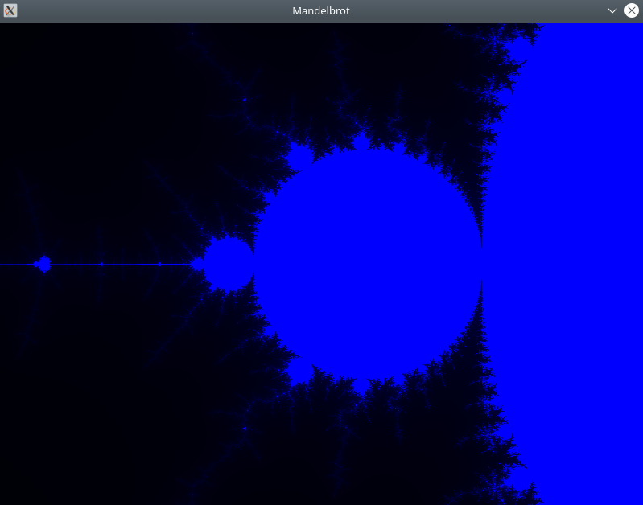

# Mandelbrot set rendering optimization using vector instructions

Vector instructions are often used in graphics. It allows to process more pixels of image one time. In particular, the rendering of the mandelbrot set is one of the running test tasks for testing the performance of some systems.

Using of vector instructions supported by avx2 module allowed to increase speed of execution by 4 times.

You can test it:

build:

`make all`

run:

`./bin/mandelbrot.out`

clean:

`make clean`

Control:

`left shift` - zoom out

`right shift` - zoom in

`arrows` - move to left, right, up, down

`avx2` branch contains realisation with vector instructions, `no_optimization` contains realisation without use of it. First one runs faster about 3.5-4 times (if i decreased accuracy, it could run faster about 6-8 times).